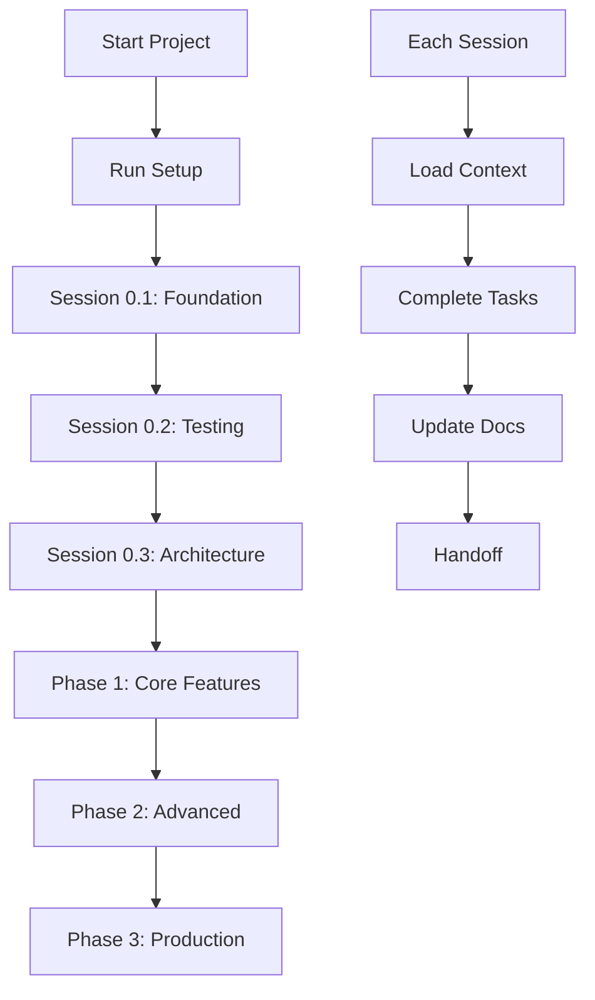

# 🚀 ProjectSetupContext - Master Setup Guide

note from author: This is an improvement made to an existing system I was using that was incredibly effective. I'm looking forward to testing this more complete solution as it has a structure that better maintains symbol recognition (naming convention) and will hopeful help with the abstraction complexity when working with more conplex architecture (my memory ststems).

cheers,
steve

## 📋 Overview
This folder contains everything needed to initialize a new project with Claude Code using the template-based development system. When starting a new project, simply reference this folder and Claude Code will set up the entire workflow.

## 🚀 Installation

### Option 1: Clone the Repository
```bash
git clone https://github.com/stevenjjobson/CoachNTT-ProjectSetupContext.git
cd CoachNTT-ProjectSetupContext
```

### Option 2: Download ZIP
Download the latest release from [GitHub Releases](https://github.com/stevenjjobson/CoachNTT-ProjectSetupContext/releases)

## 🎯 Quick Start

### Automated Setup (Recommended)
```bash
./scripts/setup.sh my-project web-api typescript
```

### Manual Setup with Claude Code
```markdown
I'm starting a new project. Please use the ProjectSetupContext folder to set up the complete development workflow.

Project Details:
- Name: [PROJECT_NAME]
- Type: [web app/API/library/etc]
- Tech Stack: [TypeScript/Python/etc]
- Features: [list main features]

Please:
1. Copy all templates from ProjectSetupContext/templates/
2. Customize them for this project
3. Create the initial project structure
4. Set up the development workflow
5. Prepare for Session 0.1
```

## 📁 Folder Structure

```
CoachNTT-ProjectSetupContext/
├── README.md                     # This file
├── LICENSE                       # MIT License
├── .gitignore                    # Git ignore rules
├── docs/                         # Documentation
│   ├── START_HERE.md            # Quick start guide
│   ├── START_HERE_v2.md         # Enhanced quick start
│   ├── MASTER_SETUP_GUIDE.md    # Comprehensive setup
│   ├── COMPLETE_GUIDE.md        # Complete documentation
│   ├── SETUP_INSTRUCTIONS.md    # Detailed setup steps
│   ├── PRD_TEMPLATE.md          # Product requirements template
│   ├── RECOVERY_GUIDE.md        # Troubleshooting guide
│   ├── IMPROVEMENTS_IMPLEMENTED.md # Version history
│   └── TEMPLATE_ORGANIZATION.md # Template structure guide
├── templates/                    # All template files
│   ├── core/                    # Core workflow templates
│   │   ├── CLAUDE.md.template
│   │   ├── Implementation_Cadence.md.template
│   │   ├── SESSION_LOG.md.template
│   │   ├── NEXT_SESSION.md.template
│   │   └── verify_setup.py.template
│   ├── session-management/      # Session management
│   │   ├── CONTEXT_MANAGEMENT.md
│   │   ├── SESSION_PATTERNS.md
│   │   ├── SESSION_PROTOCOL.md
│   │   ├── SESSION_SUMMARY.md
│   │   ├── CHECKPOINT_COMMIT.md
│   │   ├── PROJECT_START.md
│   │   └── REALITY_CHECK.md
│   ├── project/                 # Project setup files
│   │   ├── .gitignore.template
│   │   ├── Makefile.template
│   │   └── quick-verify.sh
│   └── workflow/                # Workflow principles
│       └── REALITY_PRINCIPLES.md
├── examples/                    # Example implementations
│   ├── python-cli-setup.md
│   ├── react-saas-setup.md
│   └── task-api-setup.md
├── checklists/                  # Quick reference checklists
│   ├── SETUP_CHECKLIST.md
│   └── SESSION_CHECKLIST.md
└── scripts/                     # Utility scripts
    └── setup.sh                 # Automated setup script
```

## 🔧 What This System Provides

### 1. **Structured Development Workflow**
- Session-based development (2-3 hour focused sessions)
- Context window optimization
- Progressive enhancement approach
- Built-in quality from foundation

### 2. **Context Management**
- Efficient context loading strategies
- Smart handoff between sessions
- Pattern libraries and caching
- Automated optimization tools

### 3. **Living Documentation**
- Self-documenting code structure
- GraphQL schema as documentation
- Session logs for history
- Decision tracking

### 4. **Quality Assurance**
- Test-driven development built-in
- Automated verification scripts
- Code generation for consistency
- Performance tracking

## 📊 Workflow Overview



## 🎨 Customization Points

When setting up a new project, customize these areas:

1. **Technology Stack**
   - Language-specific linters
   - Framework-specific patterns
   - Build tool configuration

2. **Project Type**
   - API: Add OpenAPI templates
   - Web App: Add component templates
   - Library: Add publishing configs

3. **Team Size**
   - Solo: Simplified workflow
   - Team: Add PR templates
   - Enterprise: Add compliance docs

## 🚀 Benefits of This System

- **40-60% less context usage** compared to ad-hoc development
- **Consistent patterns** across the entire project
- **Self-documenting** through templates and conventions
- **Scalable** from prototype to production
- **AI-optimized** for Claude Code development

---

*This ProjectSetupContext folder is your complete toolkit for structured, efficient development with Claude Code.*